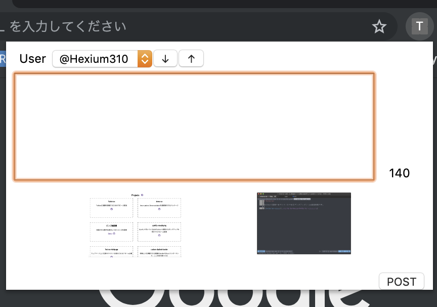

# [Twiterian](https://github.com/hexium310/twiterian)

TwiterianはTwitterに画像つきでツイートできるChrome拡張機能です。
Chrome ウェブストアにはそのうち登録します。

## 機能

- クリップボードから画像の貼り付けることができます
- 投稿もしくは削除するまで画像を保持します
- 複数のアカウントでログインしてドロップダウンで切り替えられます（矢印キーで前後のアカウントに切り替えられます）
